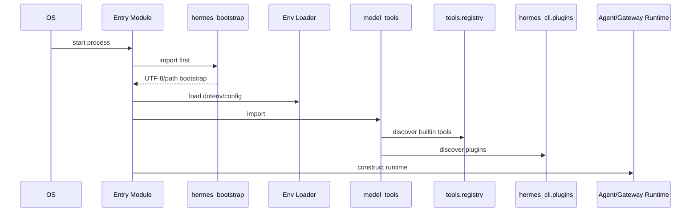

# Startup Sequence

This file documents the verified startup path for the main Hermes entrypoints.

## Primary Startup Paths

### `hermes-agent`

1. Python imports `run_agent.py`.
2. `run_agent.py` imports `hermes_bootstrap` first.
3. `hermes_bootstrap.py` applies Windows UTF-8 stdio setup and import-path hardening.
4. `run_agent.py` loads environment variables through `hermes_cli.env_loader.load_hermes_dotenv(...)`.
5. `run_agent.py` imports `model_tools`, which triggers tool discovery.
6. `model_tools.py` imports `tools.registry` and self-registering built-in tools.
7. `model_tools.py` triggers plugin discovery via `hermes_cli.plugins.discover_plugins()`.
8. `run_agent.py` continues into runtime construction and conversation handling.

### `hermes`

1. Python imports `hermes_cli.main`.
2. `hermes_cli.main` imports `hermes_bootstrap` first.
3. The CLI resolves the desired interface early, including TUI gating.
4. `hermes_cli.config` and related modules are loaded.
5. CLI startup path constructs the selected command surface or interactive REPL.

### `gateway.run`

1. Python imports `gateway/run.py`.
2. `gateway/run.py` imports `hermes_bootstrap` first.
3. Gateway config is loaded from `hermes_cli.config`.
4. Messaging platform adapters and gateway runtime support are initialized.
5. Gateway session handling and agent cache are prepared.

## Sequence Diagram

## Verified Startup Characteristics

- Bootstrap is import-time, not deferred.
- Tool discovery happens during `model_tools` import.
- Plugin discovery happens during `model_tools` import as well.
- The gateway and CLI both depend on `hermes_cli.config`.
- Entry modules are designed to be import-safe even when some optional pieces are missing.
