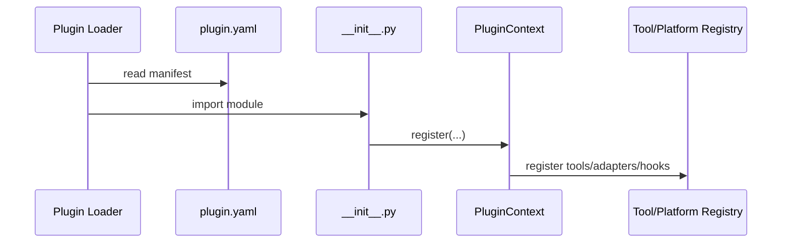

# Plugin Architecture

Hermes has a bundled plugin system that loads extensions from multiple sources.

## Discovery Sources

1. Bundled plugins in the repository `plugins/` tree.
2. User plugins under `~/.hermes/plugins/`.
3. Project plugins under `./.hermes/plugins/` when enabled.
4. Pip-installed plugins discovered via the `hermes_agent.plugins` entry-point group.

## Plugin Contract

The plugin loader documents the required plugin shape:

- `plugin.yaml` manifest
- `__init__.py`
- `register(ctx)` entrypoint

## Lifecycle Hooks

The plugin system exposes a large set of hooks, including:

- `pre_tool_call`
- `post_tool_call`
- `pre_llm_call`
- `post_llm_call`
- `on_session_start`
- `on_session_end`
- `pre_gateway_dispatch`
- approval hooks
- kanban hooks

## Runtime Integration

Plugins may register:

- tools through the tool registry
- CLI commands
- platform adapters
- runtime callbacks
- configuration and setup behaviors

## Example: Teams Pipeline

The `teams_pipeline` plugin demonstrates the current plugin shape:

- manifest in `plugins/teams_pipeline/plugin.yaml`
- registration in `plugins/teams_pipeline/__init__.py`
- runtime binding in `plugins/teams_pipeline/runtime.py`
- CLI surface in `plugins/teams_pipeline/cli.py`
- state in `plugins/teams_pipeline/store.py`

## Sequence Diagram

## Verified Characteristics

- Plugin discovery is separate from tool discovery, but tool discovery triggers plugin discovery during startup.
- The system is intentionally broad enough to support CLI, gateway, and runtime contributions.
