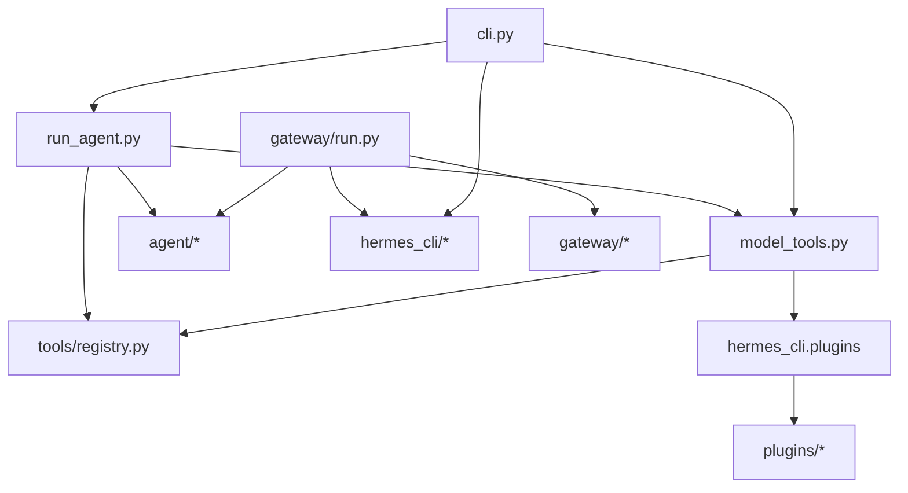

# Dependency Graph

## High-Level Graph

## Core Modules

- `run_agent.py`
- `model_tools.py`
- `tools/registry.py`
- `agent/*`
- `gateway/*`
- `hermes_cli/*`

## Shared Modules

- `utils.py`
- `hermes_constants.py`
- `hermes_bootstrap.py`

## Leaf Modules

Many tool and plugin files are leaf nodes that register behavior into the core registries.

## Coupling Notes

- The tool registry is a central dependency.
- Plugin discovery is a central extension boundary.
- Memory/provider interfaces are intentionally narrow.
