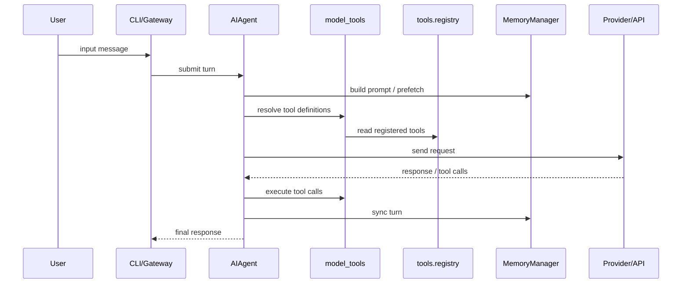
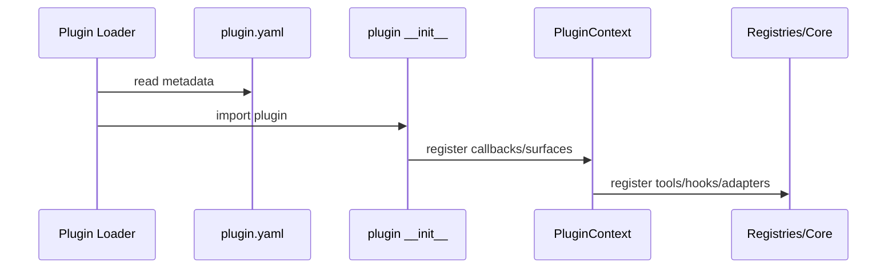
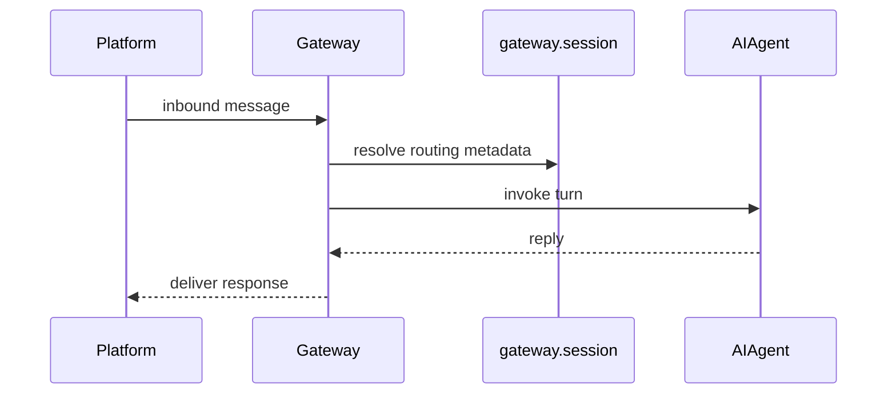

# Sequence Diagrams

## Agent Request Flow

```mermaid
sequenceDiagram
    participant User
    participant CLI as CLI/Gateway
    participant Agent as AIAgent
    participant Tools as model_tools
    participant Registry as tools.registry
    participant Memory as MemoryManager
    participant Model as Provider/API

    User->>CLI: input message
    CLI->>Agent: submit turn
    Agent->>Memory: build prompt / prefetch
    Agent->>Tools: resolve tool definitions
    Tools->>Registry: read registered tools
    Agent->>Model: send request
    Model-->>Agent: response / tool calls
    Agent->>Tools: execute tool calls
    Agent->>Memory: sync turn
    Agent-->>CLI: final response
```

## Plugin Load Flow

```mermaid
sequenceDiagram
    participant Loader as Plugin Loader
    participant Manifest as plugin.yaml
    participant Module as plugin __init__
    participant Ctx as PluginContext
    participant Core as Registries/Core

    Loader->>Manifest: read metadata
    Loader->>Module: import plugin
    Module->>Ctx: register callbacks/surfaces
    Ctx->>Core: register tools/hooks/adapters
```

## Gateway Session Flow

```mermaid
sequenceDiagram
    participant Platform
    participant Gateway
    participant Session as gateway.session
    participant Agent as AIAgent

    Platform->>Gateway: inbound message
    Gateway->>Session: resolve routing metadata
    Gateway->>Agent: invoke turn
    Agent-->>Gateway: reply
    Gateway-->>Platform: deliver response
```
