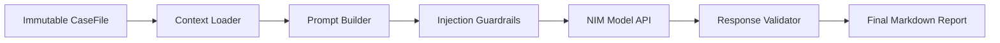

# AI Report Generation Specification

## Purpose
This document specifies the AI report generation design, prompt templates, validation pipelines, NIM endpoint configurations, and output formats implemented in the Lokii Platform.

## Overview
AI report generation is handled by the AI Report Service (`ai-report-service`). It is a downstream rendering engine that consumes immutable CaseFiles, processes them through structured prompt templates, validates references, and calls LLM providers (NVIDIA NIM or Gemini) to generate incident summaries.

---

## Detailed Explanation

### 1. The Prompt Pipeline
To ensure factual accuracy and prevent hallucinations, LLM queries go through a multi-stage pipeline:

### 2. Provider Abstractions
The service supports multiple API adapters:
- **`NIMProvider`**: Connects to local or remote NVIDIA NIM compatibility endpoints (`meta/llama-3.1-70b-instruct`).
- **`GeminiProvider`**: Direct Google Gemini API adapter.
- **`MockLLMProvider`**: Default provider for sandbox testing; returns deterministic mock content without calling external APIs.

### 3. Report Types and Templates
Lokii supports multiple report types:
- **Executive**: High-level business impact, financial exposure, and containment status.
- **SOC Brief**: Active timeline metrics, mapped indicators, and remediation steps.
- **Technical**: Graph linkages, blast radius calculations, and payload decodes.
- **Compliance**: Regulatory reporting mappings (e.g. DORA, PCI-DSS compliance).

### 4. Input Guardrails and Traceability
- **Injection Protection**: Sanitizes input strings to filter out malicious prompts.
- **Traceability**: The response validator rejects reports that contain unsupported citations or modify deterministic confidence values.

---

## Workflow

### Report Compilation Steps
1. **Request**: Case Builder or operator sends a request to `POST /api/v1/reports`.
2. **Build**: The prompt builder extracts the timeline and evidence from the CaseFile, formatting them into a structured prompt.
3. **Generate**: The API provider passes the prompt to the NVIDIA NIM endpoint.
4. **Validate**: The validator checks the response for mandatory sections and confirms that all indicators are cited in the source CaseFile.
5. **Persist**: The final markdown report is saved to the repository.

---

## Design Decisions
- **Factual Segregation**: The AI Report Service is downstream; it cannot modify CaseFiles, compute confidence, or issue execution actions.
- **Gemini Model Selection**: Gemini model configuration defaults to `gemini-2.5-flash` with a temperature of `0.0` to minimize variance in the output.

## Best Practices
- **Factual Reference checks**: Ensure all entities referenced in the generated report exist in the source CaseFile.
- **Fail Safe Default**: Fall back to the `MockLLMProvider` if downstream NIM API endpoints timeout.

## Future Enhancements
- Export reports to HTML and PDF-ready output formats.
- Implement response-checking loops that automatically re-prompt the LLM if validation fails.
