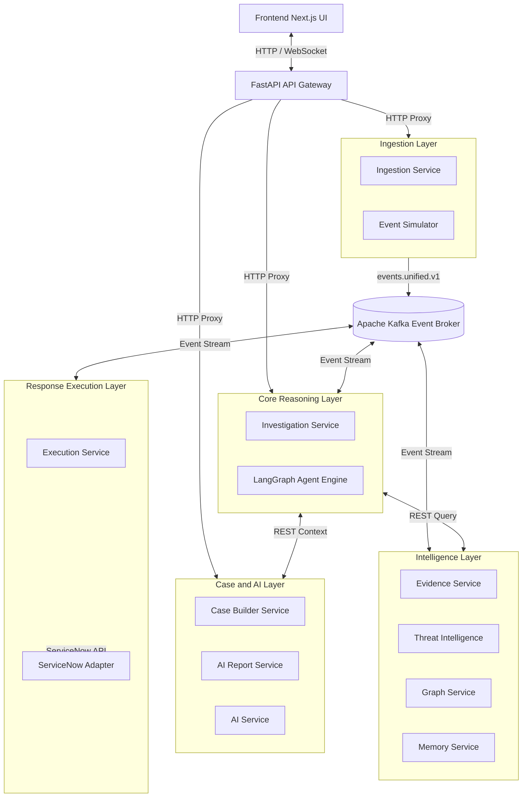

# Master Documentation Index

## Purpose
This document serves as the entry point and master index for the complete technical documentation suite of the Lokii Platform. It outlines the platform's architectural topology, directory structure, microservice layouts, and provides direct reference links to each specialized subsystem design specification.

## Overview
The Lokii Platform is an autonomous, event-driven cybersecurity investigation and decision framework tailored specifically for financial institutions. The system operates on a pipeline that ingests raw telemetry, extracts entities, maps indicators to the MITRE ATT&CK taxonomy, constructs transactional relationship graphs in Neo4j, reasons about threats using stateful LangGraph agents, builds CaseFiles, formats compliance and incident summaries, and triggers responses via ServiceNow tickets.

This documentation index connects developers, systems architects, and security operations personnel to the corresponding specifications for requirements, agent design, databases, networks, API surfaces, events, and user interfaces.

## Architecture
The platform is designed around decoupled microservices communicating asynchronously via Apache Kafka and synchronously via FastAPI REST endpoints proxy-routed through a central Gateway.

---

## Detailed Explanation

The documentation suite is structured into 16 distinct documents, each detailing a specific component or governance standard of the platform:

| Document | Target Audience | Scope |
|----------|-----------------|-------|
| [Software Requirements Specification](SOFTWARE_REQUIREMENTS_SPECIFICATION.md) | Business Analysts, Architects | Purpose, Scope, Functional and Non-Functional Requirements |
| [System Architecture](SYSTEM_ARCHITECTURE.md) | Systems Engineers, DevOps | High-level microservices topology, request flow, and communication models |
| [MVP Architecture](MVP_ARCHITECTURE.md) | Product Owners, Engineers | MVP scope definitions, implemented simplification structures, and gaps |
| [Agent Runtime Flow](AGENT_RUNTIME_FLOW.md) | AI Engineers, SOC Developers | LangGraph engine execution sequence, state transitions, and tool boundaries |
| [API Documentation](API_DOCUMENTATION.md) | Backend Engineers, UI Developers | Complete REST interface endpoints mapping across services |
| [Database Design](DATABASE_DESIGN.md) | Database Administrators | PostgreSQL, Neo4j, and Redis persistence mapping schemas |
| [Event Schema Specification](EVENT_SCHEMA_SPECIFICATION.md) | Integration Engineers, Ops | Kafka topic definitions, publisher/consumer contracts, and schemas |
| [Threat Intelligence Design](THREAT_INTELLIGENCE_DESIGN.md) | Security Analysts, Devs | Telemetry enrichment, MITRE technique mappings, and threat indicators |
| [Graph Intelligence](GRAPH_INTELLIGENCE.md) | Graph Developers, Architects | Neo4j traversals, blast radius queries, and node expansion details |
| [Case Management Specification](CASE_MANAGEMENT_SPECIFICATION.md) | Compliance Officers, Developers | CaseFile schemas, audit trails, and versioning rules |
| [AI Report Generation](AI_REPORT_GENERATION.md) | Technical Writers, AI Engineers | Prompt formatting pipelines, NIM endpoints integration, and guardrails |
| [Deployment Guide](DEPLOYMENT_GUIDE.md) | DevOps, System Administrators | Docker Compose instructions, environment configurations, and startup orders |
| [Security Architecture](SECURITY_ARCHITECTURE.md) | Security Engineers | Authentication, CORS rules, container isolation, and tool routing policies |
| [Architecture Decisions](ARCHITECTURE_DECISIONS.md) | Architects, Engineering Leads | ADR-formatted rationales, alternatives, and benefits for tech choices |
| [User Guide](USER_GUIDE.md) | SOC Analysts, Operators | Dashboard execution steps, incident triage instructions, and simulator usage |

---

## Workflow

### 1. Ingestion Flow
Telemetry events (authentications, devices changes, transaction alerts) move from the Event Simulator to the Ingestion Service, which deduplicates and standardizes the payloads before publishing to Kafka.

### 2. Entity Parsing Flow
The Evidence Service consumes ingestion streams, extracts actors, and saves nodes (Users, Accounts, IPs) in Neo4j.

### 3. Investigation Cycle
The Threat Intelligence service scans the evidence nodes and issues candidates. The Investigation Service instantiates a stateful LangGraph Agent that traverses graphs, evaluates history, decides hypotheses, aggregates confidence scores, and formats CaseFiles.

### 4. Downstream Action Execution
The Execution Service plans response tasks, validates safety boundaries, and pushes commands to the ServiceNow Adapter to manage incidents.

---

## Design Decisions
- **Unified Location**: All specifications are kept within the `docs/` subdirectory to maintain repository integrity and keep documentation close to code modifications.
- **Service Segregation**: Documentation mirrors the actual service architecture, matching API routing and topic structures strictly with the repository's FastAPI files and compose manifests.

## Best Practices
- **Sync with Code**: Ensure files are updated whenever Pydantic schemas, Kafka topics, or service ports are modified.
- **Reference Contracts**: Reference definitions under `docs/contracts/` and `docs/domain/` to ensure naming alignment.
- **No Placeholders**: Maintain complete structural specifications for every REST and Kafka wire schema.

## Future Enhancements
- Integrate automatic schema-to-docs generation tools (such as Sphinx or MkDocs) to parse FastAPI router annotations and Pydantic validation specs dynamically into this folder.
