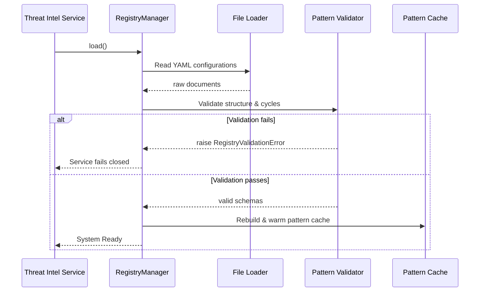

# Threat Intelligence Design Specification

## Purpose
This document specifies the threat intelligence matching architecture, MITRE ATT&CK mapping frameworks, registry validation cycles, and confidence scoring rules implemented in the Lokii Platform.

## Overview
Threat Intelligence in Lokii is governed by the Threat Intelligence and Knowledge Platform microservices. It is built to run deterministic pattern scans against evidence graphs without reliance on probabilistic AI models. Detections map directly to MITRE ATT&CK techniques, and threat definitions are loaded dynamically via a structured registry validation pipeline.

---

## Detailed Explanation

### 1. The Knowledge Platform
The Knowledge Platform is an in-memory threat registry within the Threat Intelligence Service. It acts as a decoupled boundary managing:
- **MITRE ATT&CK Ontologies**: Catalog of techniques starting with code `T` (e.g. `T1110` for Brute Force).
- **Indicators of Compromise (IOCs)**: Hashes, domain lists, and anomalous IP addresses.
- **Attack Patterns**: Structurally defined graph signatures (rules) detailing attacker actions.

### 2. RegistryManager Lifecycle and Validation Flow
Threat patterns are authored as YAML files and loaded dynamically using `RegistryManager`:

### 3. Pattern Matching Logic
Scans evidence graph updates to match attack signatures. The public matcher contract evaluates:
- **`match_pattern_graph(registry, pattern_name, evidence_graph)`**: Translates pattern requirements into graph queries, identifying matched nodes (User, Device, IP) and linkages.
- **Deduplication**: Suppresses repeat triggers for matching correlation IDs.

### 4. Deterministic Confidence Scoring
Confidence scoring is calculated by the Investigation Service, separate from LLM operations:
- **Base Score**: Predefined weights attached to matched patterns (e.g., `Credential Stuffing` = 88%, `Account Takeover` = 94%).
- **Verification Weights**: Adjusted based on present indicators (e.g., successful login from a new device + large money transfer boosts confidence to maximum).
- **Missing Gaps**: Gaps in evidence (e.g., missing multi-factor authentication logs) decrease the final confidence score.

---

## Workflow

### Incident Detection Flow
1. **Evidence Update**: Evidence Service emits `evidence.graph.events.v1`.
2. **Scan**: Threat Intelligence consumes the event and queries `RegistryManager` for the latest patterns.
3. **Match**: The graph matcher verifies if nodes and link connections trigger signature criteria.
4. **Triage**: If a match is found, the system registers the threat and pushes a candidate alert to `investigation.candidates.v1` to initiate triage.

---

## Design Decisions
- **Fail-Closed Validation**: Structural issues or cycle loops (e.g. cyclically dependent patterns) in loaded YAML templates raise a `RegistryValidationError`, causing the service startup to fail closed.
- **Deterministic-AI Boundary**: Confidence math and pattern matches are computed deterministically. AI layers compile summaries but cannot modify scores.

## Best Practices
- **Acyclic DAGs**: Ensure dependency and recommendation chains in threat patterns are strictly acyclic.
- **Strict MITRE Technique Coding**: Always format MITRE references with technique codes starting with `T` followed by numeric codes (e.g. `T1110`).

## Future Enhancements
- Transition in-memory threat registries to Neo4j graph schemas to support dynamically updated threat feeds.
- Implement weight-tuning models that adjust pattern match severity scores based on historical feedback.
