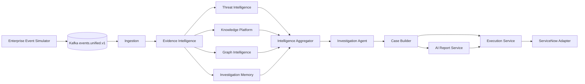

# SentinelIQ Integrated Architecture

The dotted/HTTP-style downstream links are represented as directed edges in the diagram; the integration harness validates their payload contracts without requiring all infrastructure containers.
