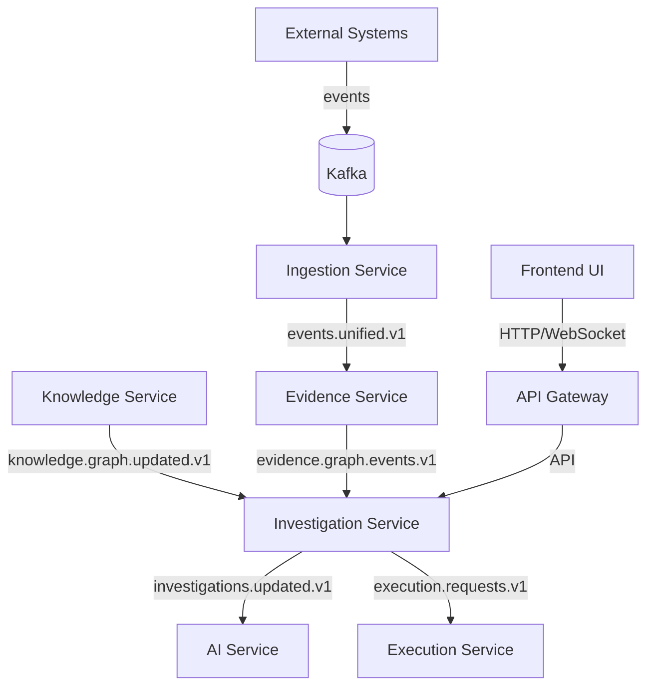
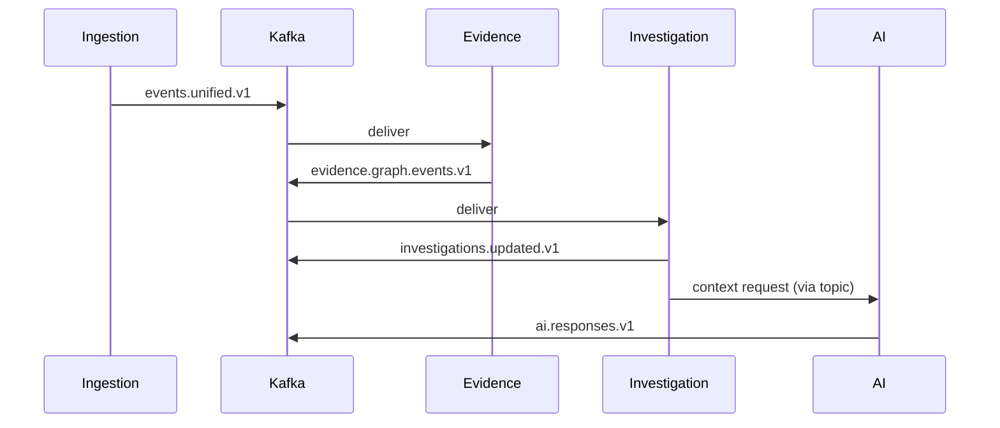
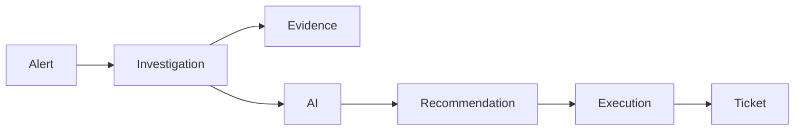
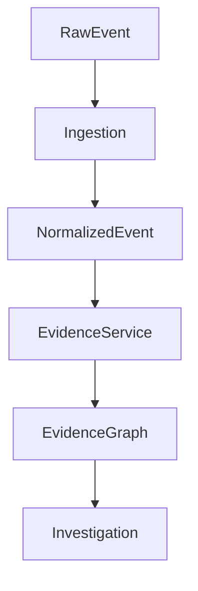

# 09 — Architecture Diagrams (Mermaid)

## System Context



## Kafka Flow



## Investigation Flow



## Evidence Lifecycle



Notes: diagrams render with Mermaid; keep them updated as ADRs evolve.
```
