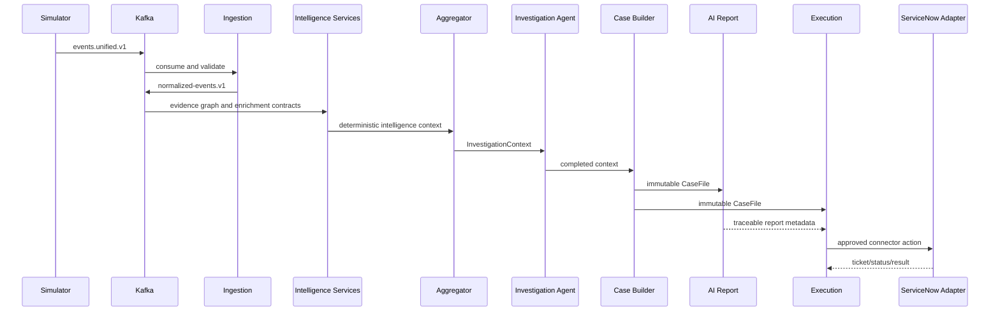

# SentinelIQ Integrated Sequence

```mermaid
sequenceDiagram
  participant Sim as Simulator
  participant Bus as Kafka
  participant Ing as Ingestion
  participant Intel as Intelligence Services
  participant Agg as Aggregator
  participant Agent as Investigation Agent
  participant Case as Case Builder
  participant Report as AI Report
  participant Exec as Execution
  participant SN as ServiceNow Adapter
  Sim->>Bus: events.unified.v1
  Bus->>Ing: consume and validate
  Ing->>Bus: normalized-events.v1
  Bus->>Intel: evidence graph and enrichment contracts
  Intel->>Agg: deterministic intelligence context
  Agg->>Agent: InvestigationContext
  Agent->>Case: completed context
  Case->>Report: immutable CaseFile
  Case->>Exec: immutable CaseFile
  Report-->>Exec: traceable report metadata
  Exec->>SN: approved connector action
  SN-->>Exec: ticket/status/result
```
