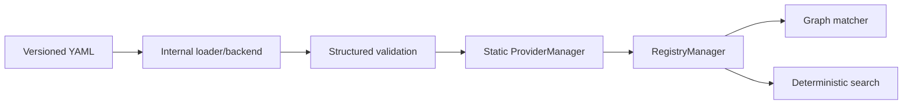
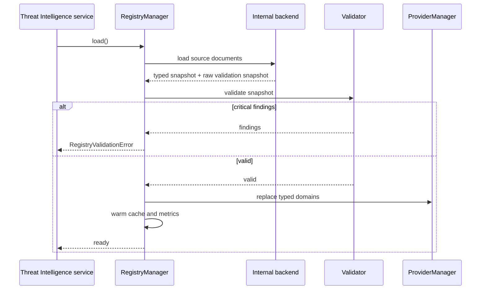
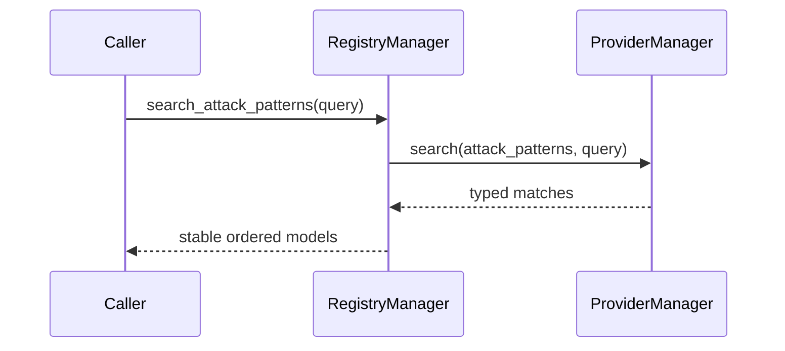

# Knowledge Platform

The Knowledge Platform is an in-memory, provider-independent boundary for deterministic Threat Intelligence matching. `RegistryManager` is the only API used by the matcher and service orchestration.

## Architecture

The loader, backend, cache, validation implementation, and providers are internal. They must not cross the `RegistryManager` boundary.

## Provider architecture

`ProviderManager` owns static in-memory providers for attack patterns, MITRE, fraud, indicators, recommendations, confidence models, and relationships. Providers expose typed snapshots, lookup, and deterministic search. No network, Redis, Neo4j, persistence, or external feed is used.

## Lifecycle and validation flow

1. `RegistryManager.load()` loads the versioned source through the internal backend.
2. Structured validation checks required fields, versions, graph references, recommendation references, MITRE IDs, indicators, confidence weights, severity/risk values, and dependency cycles.
3. Critical findings raise `RegistryValidationError`; service startup therefore fails closed.
4. Valid typed objects are copied into static providers.
5. The pattern cache is warmed and load metrics are recorded.
6. `reload_registry()` invalidates the cache, rebuilds providers, validates again, and warms the replacement snapshot.

## Search flow

Search is case-insensitive, deterministic, and returns typed objects. Pattern results are ordered by name and semantic version. Domain-specific methods (`search_attack_patterns`, `search_indicators`, `search_mitre`, and `search_fraud_patterns`) avoid leaking provider instances.

## Cache and versioning

The cache is an in-memory snapshot with configurable TTL. Hits, misses, load time, reload time, registry version, validation status, and knowledge size are exposed by `get_registry_statistics()`. Explicit invalidation occurs before reload. Latest-version resolution compares numeric version components before lexical components, so `1.10` is newer than `1.2`.

## Matcher contract

The matcher calls only:

- `get_latest_pattern(name)`
- typed `AttackPattern` fields returned by the manager

Its public entry point is `match_pattern_graph(registry, pattern_name, evidence_graph)`. It does not import or access repositories, loaders, validators, providers, cache objects, YAML, or backend structures.

## Authoring guidance

Keep each pattern versioned and deterministic. Node IDs used by edges must exist in the same pattern. Recommendation evidence must refer to node requirements or declared indicators. Dependency and recommendation graphs must be acyclic. Use `low`, `medium`, `high`, or `critical` for severity and risk level, and MITRE technique identifiers beginning with `T`.
